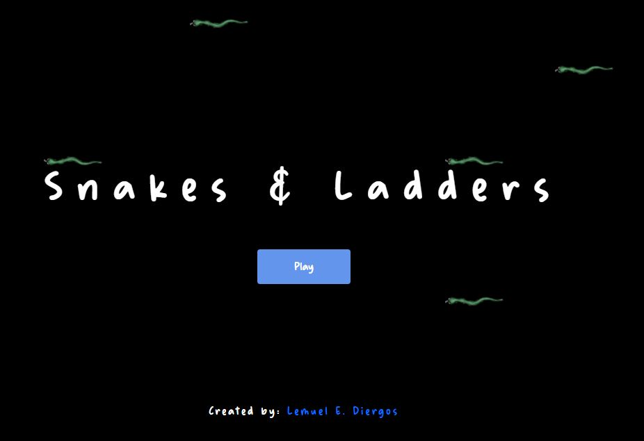

<h1>Snakes and Ladders</h1>
<h4>DETAILS</h4>
 
    <b>PROGRAMMED BY: &emsp;&emsp;&emsp;</b><i>Lemuel E. Diergos</i> 
    <b>FACEBOOK:&emsp;&emsp;&emsp;&emsp;&emsp;&emsp;&emsp;</b><i>https://www.facebook.com/lemuel.diergos.1</i> 
    <b>TWITTER:&emsp;&emsp;&emsp;&emsp;&emsp;&emsp;&emsp;&emsp;</b><i>@lemuel_diergos</i> 
    <!--<b>PERSONAL SITE:&emsp;&emsp;&emsp;&emsp;&emsp;</b><i>https://lemueldiergos.github.io</i> -->
    <b>LANGUAGE USED:&emsp;&emsp;&emsp;&emsp;</b><i>HTML, CSS, Javascript</i> 
    <b>IDE USED:&emsp;&emsp;&emsp;&emsp;&emsp;&emsp;&emsp;&emsp;</b><i>VSCode</i> 
    <b>DATE CREATED:&emsp;&emsp;&emsp;&emsp;&emsp;</b><i>FEB. 11, 2022</i> 
   

    I simply used HTML5 canvas for making this simple game, without using any  
    game engines and it is purely written in Javascript. I also used bootstrap  
    to make this game much more responsive in other devices and way more faster  
    to code. 

 
   
 <h4>Preview</h4>
 
 
