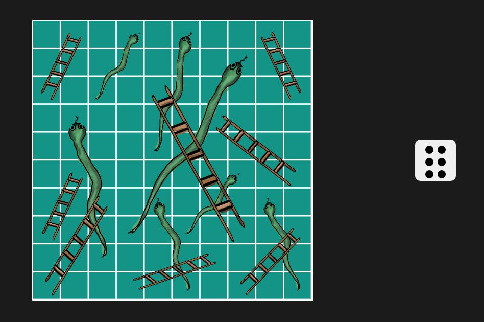

<h2>DETAILS</h2>
 
    <b>PROGRAMMED BY: &emsp;&emsp;&emsp;</b>Lemuel E. Diergos 
    <b>GITHUB: &emsp;&emsp;&emsp;&emsp;&emsp;&emsp;&emsp;&emsp;</b>https://github.com/lemueldiergos 
    <b>FACEBOOK:&emsp;&emsp;&emsp;&emsp;&emsp;&emsp;&emsp;</b>https://www.facebook.com/lemuel.diergos.1 
    <b>PERSONAL SITE:&emsp;&emsp;&emsp;&emsp;&emsp;</b>https://lemueldiergos.github.io 
    <b>LANGUAGE USED:&emsp;&emsp;&emsp;&emsp;</b>HTML, CSS, Javascript 
    <b>IDE USED:&emsp;&emsp;&emsp;&emsp;&emsp;&emsp;&emsp;&emsp;</b>VSCode 
    <b>DATE CREATED:&emsp;&emsp;&emsp;&emsp;&emsp;</b>FEB. 11, 2022 
 
   
 <h2>Preview</h2>
 
